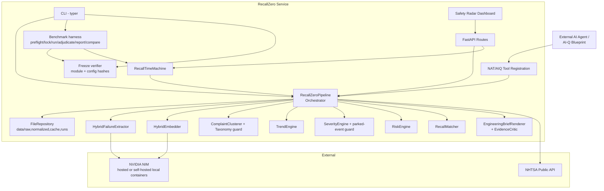
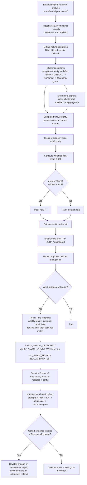
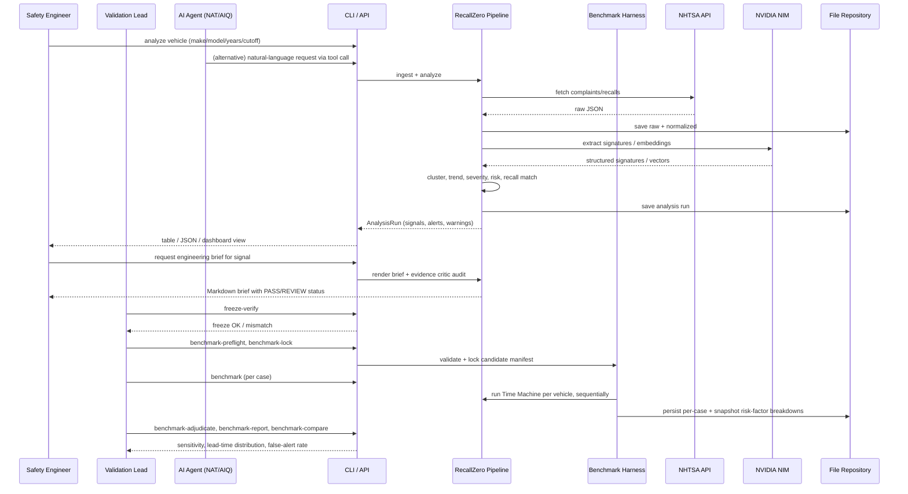

# RecallZero — Complete Application Walkthrough

*(RecallZero is not a typical customer-facing business app — it's an **engineering safety-intelligence tool**. I've mapped every section you asked for onto its real workflow: instead of a "customer" placing an "order," you have a **safety engineer** investigating a **vehicle population** using public complaint data. I call this out explicitly wherever the standard business template doesn't map 1:1.)*

> **Update note (this revision):** the codebase has moved from a single-vehicle prototype (0.3.2) through a severity/taxonomy correctness pass (0.3.3a1/0.3.3a2) into a frozen, benchmark-driven validation phase (0.3.4/0.3.5, currently `0.3.5.post1`). Detector logic (severity, taxonomy, clustering, risk, matching, Time Machine) is now **frozen** under `benchmarks/detector_freeze_v1.yaml`, and a manifest-driven multi-case benchmark harness (`recallzero benchmark*` commands) has replaced ad hoc single-vehicle tuning. This revision updates every section below to reflect that.

---

## 1. Executive Summary

### The problem in plain English

Imagine thousands of people write short complaint letters to a government safety agency (NHTSA — the U.S. National Highway Traffic Safety Administration) whenever their car does something scary: brakes fail, the car shuts off on the highway, the steering locks up. Each complaint is filed separately by an unrelated stranger, in their own words, on their own day.

Somewhere hidden inside those thousands of scattered, differently-worded complaints might be an **early pattern** — the first whisper of a defect that will eventually become a massive, expensive, safety-critical recall. Today, humans (safety engineers, journalists, regulators) have to read narrative text manually or rely on crude keyword search to notice these patterns. By the time it's obvious to everyone, an official recall has often already been issued — meaning the warning came *after* the fact, not before it.

**RecallZero's job:** read all the complaints for one specific vehicle (make/model/years), group the ones that sound like the same underlying problem, and calculate a transparent numeric "risk score" for each group so an engineer can be pointed at the two or three patterns worth investigating *before* they turn into a formal recall — instead of reading 3,000 raw complaints.

### Who has this problem
- **Automotive OEM safety/quality engineers** — need to triage early-warning signals across their fleet without manually reading every complaint.
- **Regulatory affairs / compliance teams** — need defensible, explainable evidence trails when deciding whether an issue needs escalation.
- **Researchers / journalists / analysts** — want to retrospectively check "could this recall have been predicted earlier?"

### What happened before this application existed
- Analysts searched NHTSA's public complaint database with keyword search (e.g., "brake," "fire") and manually skimmed results.
- Trend detection was ad hoc — no consistent, repeatable scoring method.
- No systematic way to test *whether a detection method actually works* against real historical recalls without accidentally "cheating" (using future information you shouldn't have had yet).
- LLM/AI summarization tools existed generically but weren't grounded in verifiable NHTSA identifiers or deterministic math — making them unusable as safety evidence, since an AI could hallucinate a trend, a recall status, or a complaint count.

### What value is created
- **Speed**: turns thousands of free-text complaints into a ranked shortlist in minutes.
- **Traceability**: every score can be traced back to specific ODI (NHTSA's Office of Defects Investigation) complaint numbers.
- **Trust boundary discipline**: AI is only allowed to *interpret language* (what does this complaint describe?); all counting, dates, trend math, and risk scoring is done by deterministic code — not by an LLM that could invent numbers.
- **Self-testing**: the built-in "Recall Time Machine" replays history *without letting the system see the future*, so you can honestly measure "would this have warned us early, or not?" — including admitting when it wouldn't have.
- **Freeze + benchmark discipline (new)**: once the detector's severity/taxonomy logic was corrected, the project deliberately **froze it** (Detector Freeze v1) and stopped tuning against a single known case. A manifest-driven benchmark harness now measures generalization across multiple positive recalls and negative controls instead of optimizing around one compelling example.

### The five-minute story (as if telling a new employee)

> "We watch public complaint data for cars. Every complaint is a stranger describing something scary that happened to their vehicle. We use AI to translate each free-text complaint into a structured description — what broke, what system, what happened as a result — but we never let the AI just declare 'there's a trend' or 'there's a recall.' Those are computed by plain arithmetic on dates and counts, so nobody can accuse us of an AI making up a number.
>
> We then group similar complaints together — brake complaints with brake complaints, not mixed with unrelated ones — and for each group we compute five numbers: how severe are the outcomes (crashes, injuries, fires), is the complaint rate accelerating, is it persistent week over week, how much total evidence exists, and is this already explained by a recall we already know about? We combine those into one 0–100 risk score. If a group crosses 75 points and has at least four independent complaints, it becomes an **alert** worth an engineer's attention.
>
> To prove this isn't just hindsight bias, we built a 'Time Machine': it replays history week by week, hiding every complaint from after a real recall was announced, and checks whether our system would have raised an alert *before* the recall happened, purely from evidence that existed at the time. Some cases succeed, some don't — and we report both honestly, because a tool that only reports successes isn't trustworthy.
>
> And once we got a real result on our first historical case (Ford Mustang Mach-E — a qualified alert 15 days before the real recall), we deliberately stopped touching the detector. We froze it, and now we're running it unchanged against several *other* unrelated recalls and several vehicles that never had a recall at all, to see whether it actually generalizes — instead of quietly getting better and better at recognizing just the one example we already knew the answer to."

---

## 2. Business Landscape

### Business objective
Provide an evidence-grounded, explainable early-warning signal for vehicle safety defects using only public data, so an engineer can prioritize investigation time — and to prove (via historical backtesting **and now multi-case benchmarking**) whether that early-warning claim actually holds up, rather than asserting it.

### Major business processes
| # | Process | Purpose |
|---|---|---|
| 1 | **Data ingestion** | Pull and cache NHTSA complaint + recall data for a vehicle population |
| 2 | **Failure-signature extraction** | Convert free-text narrative into structured fields (system, failure mode, symptom, consequence) |
| 3 | **Semantic clustering** | Group complaints describing the same underlying issue |
| 4 | **Deterministic analytics (trend/severity/risk)** | Score each group objectively |
| 5 | **Recall cross-reference** | Check if a group is already covered by a known recall |
| 6 | **Alerting & engineering brief** | Present a ranked, human-readable investigation package |
| 7 | **Historical backtesting (Time Machine)** | Validate whether the method would have worked on a real, closed historical case |
| 8 | **Detector freeze & benchmark validation (new)** | Freeze detector logic, then measure generalization across a pre-registered cohort of positive/negative cases before touching detector code again |
| 9 | **Agent/API integration** | Let an AI agent (NAT/AIQ) or another system call these capabilities as tools |

### Participants per process and what they want

| Participant | Wants |
|---|---|
| Safety/quality engineer | A short, trustworthy list of things worth investigating, with evidence links |
| Regulatory/compliance officer | Defensible audit trail: which complaints, which dates, which scoring logic |
| Data/ML engineer (operator) | Reliable ingestion, caching, and correct fallback behavior when NVIDIA AI services fail |
| Research/validation lead | Honest, multi-case benchmark statistics (including failures and false alerts), not just one success story |
| AI agent / analyst using natural language | Ability to ask "any emerging issues on the 2022 Mach-E?" and get grounded, non-hallucinated answers |
| NHTSA (external, passive) | Not a participant — just the public data source |

### Business rules and policies influencing decisions
- **No AI-invented facts**: The extraction prompt explicitly forbids the model from inventing trend, risk, recall status, causation, or complaint counts — only deterministic code computes those.
- **Alert gate**: risk score ≥ 75 **and** at least 4 independent complaints (both configurable, but both required — evidence floor prevents a single anecdote from triggering an alert).
- **Anti-leakage discipline in backtesting**: a backtest is invalid if any future information (post-recall complaints, the target recall's own text) touched detection.
- **Transient failure policy**: if the AI service fails temporarily (rate limit/outage), the system does **not** silently fall back to a cruder method by default — because mixing extraction methods mid-analysis would corrupt the semantic clustering. This must be explicitly enabled, and a benchmark validation case additionally requires `minimum_nim_fraction = 1.0` (100% NIM-derived signatures) to be considered valid at all.
- **Severity provenance rule**: structured NHTSA fields (crash/fire/injury/death flags) are always trusted; semantic safety indicators (e.g., "loss of braking") from narrative text are only accepted if the language is event-scoped (actually happened) — negated, hypothetical, or background statements ("could have caused a fire") are explicitly rejected. A **parked-event guard** additionally cross-checks the NIM-extracted `operating_state` against narrative parked-cues so a background "while driving" phrase in an otherwise-parked complaint cannot manufacture a moving-failure indicator.
- **Taxonomy consistency guard**: a mechanism assignment that contradicts its own derived consequence family (e.g., a brake mechanism on a no-start/no-drive event) is downgraded to a general component-level mechanism rather than allowed into meta-signal aggregation. This guard is intentionally narrow and has a documented, tracked gap (see `TAX-001` below).
- **Detector freeze discipline (new)**: once Detector Freeze v1 was declared, severity, taxonomy, clustering, risk weights, thresholds, meta rules, recall matching, and Time Machine logic must not change based on a single case's outcome. Changes require multi-case benchmark evidence and are only evaluated once, at the end, against an untouched holdout split.

### Examples of normal, exceptional and rejected cases

| Case type | Example |
|---|---|
| **Normal** | 12 complaints about a Mach-E "losing all power on the highway," rising sharply in the last month → risk score 82 → ALERT |
| **Exceptional** | A cluster is large but already matches a known, visible recall → recall-gap component of risk score drops → may not alert even with many complaints, because it's already "explained" |
| **Exceptional** | AI service is down (429/503 errors exhausted) → run **fails loudly** rather than quietly mixing heuristic and AI-derived signatures; in a benchmark run, that one case is marked invalid but the rest of the cohort still completes |
| **Rejected** | A complaint says "I was worried the brakes *might* fail" → NOT counted as a validated "loss of braking" severity indicator (hypothetical language is rejected) |
| **Rejected** | A complaint's actual failure event is parked/no-start, but a later unrelated sentence mentions "while driving" → the parked-event guard suppresses the moving-failure indicator |
| **Rejected/Invalid** | A backtest where the target recall's own description leaked into detection before freezing → marked `INVALID_BACKTEST` |
| **New: benchmark-only outcome** | A targetless negative-control vehicle produces an alert with no matching recall inside its pre-registered adjudication window → labeled `UNCONFIRMED_ALERT` (an operational-burden metric, not proof the concern was false) |

---

## 3. End-to-End "Customer" Journey (Vehicle Investigation Lifecycle)

*(Here, the "customer" journey is an engineer's investigation lifecycle — the closest real analog since there's no purchase/checkout flow.)*

### Narrative example
**Engineer:** Priya, a safety analyst at an OEM quality team.
**Subject vehicle:** 2021–2022 Ford Mustang Mach-E.
**Goal:** find out if there's an emerging issue as of June 9, 2022 (one day before Ford's real high-voltage contactor recall, campaign `22V412000`, dated June 10, 2022).

#### Stage 1 — Ingestion
- **Trigger:** Priya runs `recallzero fetch --make FORD --model "MUSTANG MACH-E" --years 2021,2022` (or the API's `/api/v1/ingest`).
- **Who initiates:** Priya (human), or an AI agent on her behalf.
- **Information entering:** make, model, model years.
- **Why needed:** NHTSA's API requires an exact vehicle identity; RecallZero also auto-corrects punctuation differences between NHTSA's complaint catalog spelling ("MUSTANG MACH-E") and its recall catalog spelling ("MUSTANG MACH E").
- **What the system does:** Calls NHTSA's public complaints + recalls APIs, saves raw JSON responses (`data/raw/`), then normalizes them into strict typed records (`data/normalized/`).
- **Why:** Keeping the raw payload alongside the normalized version means every later claim can be traced back to the original government record — critical for audit trust.
- **Decision:** Is there a local cache already? → If yes and `refresh` not requested, reuse cache (faster, avoids hammering NHTSA). If no, fetch live.
- **What could go wrong:** NHTSA API unavailable → surfaces as a 502 error with a clear message rather than silent empty data.
- **Output stored:** `Complaint` and `Recall` typed records.
- **Next stage:** Extraction.

#### Stage 2 — Failure-signature extraction
- **Trigger:** Automatically follows ingestion when an analysis is requested.
- **Information entering:** Each complaint's free-text narrative (e.g., ODI #11487213: *"Vehicle lost all propulsion power while traveling at 65 mph on the highway..."*).
- **What the system does:** Sends the narrative to an NVIDIA NIM LLM (or a deterministic heuristic parser if NIM isn't configured) to extract: system, subsystem, failure mode, symptom, operating state, consequence, and severity indicators.
- **Why:** Raw language is too varied for reliable grouping ("lost all power," "car died," "no propulsion" all mean the same failure) — structured extraction normalizes vocabulary.
- **Decision:** Did extraction succeed? → cached and checkpointed incrementally so a rerun doesn't redo completed work. If NIM fails transiently (e.g., rate-limited) → by default, the whole run stops rather than silently degrading to heuristic mid-batch (configurable to allow fallback, but disallowed for benchmark validity).
- **What could go wrong:** NIM returns malformed output → validated against a strict schema; invalid non-transient output triggers heuristic fallback (if allowed) rather than corrupting results. A sustained rate limit (HTTP 429) can exhaust the retry budget (`max_retries`, exponential backoff with jitter, `Retry-After` awareness) — the affected complaint (and, in a benchmark run, only that one case) fails rather than silently using a cruder method.
- **Output stored:** `FailureSignature` records cached per complaint ID (`data/cache/`), reused across future runs for the same vehicle.
- **Next stage:** Clustering.

#### Stage 3 — Semantic clustering
- **What the system does:** Groups complaints into clusters by (1) NHTSA component family, (2) canonical defect family, then (3) DBSCAN density clustering on embeddings within each partition, refined by complete-link distance splitting.
- **Why layered like this:** Prevents a generic AI label from merging unrelated brake, propulsion, and electrical complaints into one giant meaningless cluster.
- **Decision:** Priya's Mach-E population produces a cluster labeled *"High-voltage battery junction box/contactor failure — loss of motive power,"* containing 12 complaints spanning Electrical System, Fuel/Propulsion System, and Power Train, first received Jan 2022, most recent June 8, 2022.
- **What could go wrong:** All complaints collapse into one giant cluster (quality warning fires: "DEGRADED — do not treat as validated") or one dominant cluster (>70% share) — the system flags this rather than hiding it. A **known, tracked gap (`META-001`)**: mechanism-level meta-signals can become too broad in mature datasets, admitting evidence from unrelated consequence categories; this is deferred to benchmark evidence rather than fixed reactively.
- **Next stage:** Deterministic analytics.

#### Stage 4 — Trend, severity, risk scoring
- **What the system does:**
 - **Trend:** recent 28-day complaint rate vs. baseline 84-day rate → smoothed ratio → acceleration score.
 - **Persistence:** active weeks in the last 4 weeks + longest consecutive active-week streak in the last 8 weeks.
 - **Severity:** structured NHTSA crash/fire/injury flags plus validated in-narrative safety language, cross-checked against the NIM-extracted `operating_state` so a parked no-start event cannot be mistaken for a moving-failure event.
 - **Recall gap:** compares cluster text to any recall *already visible* at the cutoff — since the real Mach-E recall is dated June 10, it is **not yet visible** at the June 9 cutoff, so the recall-gap component stays high (no existing explanation).
 - **Risk formula:** `0.30×severity + 0.25×trend + 0.15×persistence + 0.20×evidence + 0.10×recall_gap`. In the verified, leakage-safe historical replay, the frozen June 9, 2022 snapshot scores `severity 83.5, trend 55.47, persistence 62.5, evidence 86.47, recall_gap 96.03 → final 75.19`, and the peak pre-recall snapshot (May 26 / June 2, 2022) reaches `80.23`.
- **Decision:** Is `risk ≥ 75` AND `evidence_count ≥ 4`? → Yes at multiple pre-recall weekly cutoffs → **ALERT**, first qualifying on **2022-05-26**, a measured **15-day lead time** before the June 10 recall.
- **Why this exact formula and threshold:** codified in `config/risk.yml` so it's auditable, adjustable, and not buried in code — and now additionally pinned by `benchmarks/detector_freeze_v1.yaml` so it cannot silently drift between benchmark runs.
- **What happens if no:** Signal still appears in results (visible for review) but is not flagged as an alert — engineers can still see it ranked, just not prioritized to the top with an alert badge.
- **Output stored:** `DefectSignal` inside an `AnalysisRun`, saved under `data/runs/`.
- **Who needs the result:** Priya (via CLI table, API JSON, or dashboard), or an AI agent relaying it in natural language.

#### Stage 5 — Recall cross-reference (already covered in scoring, but also standalone)
- **Decision:** Text similarity between the cluster and any visible recall's component/summary/consequence/remedy text. If similarity passes threshold → `matched=True` with a campaign number. Priya's June 9 cutoff has no matching recall yet (the real one is a day away) → correctly `matched=False`.
- **Why this matters:** Prevents double-flagging issues engineers already know about, while making sure genuinely new issues aren't hidden because of coincidental keyword overlap. It's advisory ("suggestive, not a scope determination" — engineers must still verify).

#### Stage 6 — Engineering brief and evidence critic
- **What the system does:** Renders a Markdown brief: vehicle, cutoff date, issue label, priority, evidence count/IDs, trend numbers, recall status, and a rationale sentence. Before showing it, an `EvidenceCritic` runs deterministic consistency checks (do cluster counts match evidence counts? do risk contributions sum correctly? is a "matched recall" claim missing a campaign number? is this a generic/noise cluster?).
- **Why a critic exists:** Acts as a second, independent auditor so an internally-inconsistent or overconfident claim doesn't reach a human unchecked.
- **Who needs it:** Priya, for a formal investigation record; also consumable by the AI agent (`recallzero_engineering_brief` tool).

#### Stage 7 — Retrospective validation (Recall Time Machine)
- **Trigger:** Someone wants to check "would this have caught the real Mach-E recall early?"
- **What the system does:** Reruns the *entire* Stage 1–6 pipeline at weekly cutoffs, but with every complaint on/after June 10, 2022 **physically excluded** from the input — not just filtered at display time. Freezes each week's alert set *before* ever looking at the real recall's text. Only afterward does it use the real recall's description to check, post-hoc, whether any frozen alert matches it.
- **Decision:** Outcomes are one of: `EARLY_SIGNAL_DETECTED` (alert existed pre-recall AND matched target — **this is now the confirmed Mach-E outcome**), `EARLY_ALERT_TARGET_UNMATCHED`, `NO_EARLY_SIGNAL`, or `INVALID_BACKTEST`.
- **Why it's this strict:** Without this discipline, it's trivially easy to "predict" a recall after already knowing what it was about — that would be dishonest, not a real validation.
- **What's stored:** `BacktestResult` with lead-time-in-days, all weekly `BacktestSnapshot`s (each now carrying the **full per-factor risk breakdown** — score, weight, contribution per severity/trend/persistence/evidence/recall_gap factor, not just the final score), and an `anti_leakage_checks` dictionary that must all be `true` for the result to be trustworthy.
- **Who needs the result:** Research/validation leads, and anyone deciding whether to trust RecallZero's alerts going forward.

#### Stage 8 — Detector freeze and multi-case benchmark validation (new lifecycle stage)
- **Trigger:** After the Mach-E backtest first produced a qualified 15-day-lead result and a known severity/taxonomy correctness pass was applied (0.3.3a1 → 0.3.3a2), the team deliberately stopped tuning the detector against this one known case.
- **Who initiates:** The validation/research lead.
- **What the system does, in order:**
  1. `recallzero freeze-verify --manifest benchmarks/detector_freeze_v1.yaml` — hashes detector-critical modules (`severity.py`, `taxonomy.py`, `clustering.py`, `risk_engine.py`, `pipeline.py`, `recall/matcher.py`, `backtest/time_machine.py`) plus the live `config/risk.yml`-loaded values, and fails loudly if anything drifted from the frozen state.
  2. `recallzero benchmark-preflight` — checks that every pre-registered case in `config/candidates.yml` has retrievable NHTSA data and a valid case shape, **without running the detector at all**.
  3. `recallzero benchmark-lock` — commits the pre-registered case set to a lock file (`benchmarks/detector_v1_validation.lock.json`) so cases cannot be quietly swapped out after seeing results.
  4. `recallzero benchmark --manifest config/candidates.yml --freeze ... --lock ... --split validation` — runs the full leakage-safe Time Machine per case (positives) or a targetless replay (negative controls), sequentially, isolating any single case's infrastructure failure (e.g., a NIM 429) from the rest of the cohort.
  5. `recallzero benchmark-adjudicate` — for negative controls, checks whether an alert later matched a real recall inside a pre-registered adjudication window, separating `UNCONFIRMED_ALERT` (operational burden) from `FUTURE_RECALL_ASSOCIATED` (the control turned out to have a real, later recall).
  6. `recallzero benchmark-report` / `recallzero benchmark-compare` — aggregate sensitivity, lead-time distribution, false-alert rate, and unique false-lineage counts; compare two frozen detector versions factor-by-factor.
- **Why this order:** pre-registration and locking prevent "optimizing on the test set" — the same discipline the anti-leakage dates already enforce, applied to *engineering decisions* rather than just *complaint dates*.
- **Decision:** Is the cohort result strong enough, spread across enough unrelated defect families and negative controls, to justify a Detector v2 proposal? If yes, changes are developed against the development split and evaluated once against an untouched holdout split. If no, the detector stays frozen and the cohort grows.
- **What could go wrong:** A `TAX-001`-driven lineage fragmentation could make one real pattern look like several distinct false alarms in the aggregate metrics — this is an explicitly tracked interpretive caveat, not a silent risk.
- **What's stored:** `config/candidates.yml` (manifest, now containing the Mach-E validated positive plus two additional NHTSA-verified positive cases spanning unrelated defect families — GM ignition switch `14V355000`, electrical/stall; Jeep Liberty fuel tank `13V252000`, thermal/fire), `benchmarks/detector_freeze_v1.yaml` (freeze manifest), `benchmarks/KNOWN_GAPS.md` (tracked, deliberately deferred gaps), and per-run JSON/CSV under `data/runs/`.
- **Who needs it:** The validation lead, and ultimately anyone deciding whether RecallZero's alerting methodology — not just its Mach-E anecdote — is trustworthy.

---

## 4. The "Why" Analysis

| Step | Why it exists | Why here, not earlier/later | Why this actor | Why this data | Why this validation | Why not fully automatic | Risk if skipped |
|---|---|---|---|---|---|---|---|
| Raw payload caching | Auditability | At ingestion, before any transformation | System (automated) | Original NHTSA JSON | N/A | Could auto-discard, but then no audit trail | Can't defend any downstream claim if challenged |
| Structured extraction (AI) | Normalize free text into comparable fields | After ingestion, before clustering (can't cluster raw prose well) | AI (NIM) with human-designed schema | Complaint narrative | Schema validation + heuristic fallback | Would hallucinate facts if allowed to also "decide" trend/risk | Mislabeled clusters, false patterns |
| Deterministic clustering partition (component family gate) | Stop AI's fuzzy labels from merging unrelated systems | Before density clustering | Code (not AI) | NHTSA component + canonical defect family | Diagnostics (purity, largest-cluster share) | AI clustering alone is not reproducible/explainable | A "safety" cluster could mix brake and infotainment complaints, destroying trust |
| Parked-event severity guard | Prevent a background/unrelated "while driving" phrase from manufacturing a moving-failure indicator on a parked no-start event | Inside severity validation, before scoring | Code (cross-checks NIM's own `operating_state` field) | Narrative text + NIM-extracted operating state | Positive/negative regression tests against real narrative text | A single narrative-only rule can't distinguish "the failure happened while parked" from "the driver once mentioned driving" | Inflated severity on parked events, false alerts |
| Taxonomy consistency guard | Stop a mechanism assignment from contradicting its own derived consequence | Inside mechanism derivation, before meta-signal aggregation | Code (`mechanism_is_consistent`) | Derived mechanism + consequence family | Explicit allowlist of compatible mechanism/consequence pairs | A rigid keyword cascade can misclassify based on incidental word co-occurrence | Wrong complaints joining a meta-signal, corrupting evidence composition |
| Deterministic trend/severity/risk math | Auditable, reproducible scoring: no LLM inventing numbers | After clustering, once evidence is grouped | Code only | Dates, structured flags, validated narrative indicators | Formula sums verified by evidence critic | If AI computed risk, two runs could give different numbers for identical input | Non-reproducible, non-defensible risk scores |
| Alert gate (score + minimum evidence) | Avoid single-anecdote false alarms | After risk score computed | Code (config-driven) | Risk score, evidence count | Configurable thresholds, explicitly marked "unvalidated defaults" until benchmarked | Automatic threshold-only logic is fine here — it's a *filter*, not a defect determination | Analyst overload from too many trivial alerts, or missed real ones if threshold wrong |
| Recall cross-reference | Don't re-flag known issues; but don't hide new nearby issues either | After clustering, using only recalls visible at cutoff | Code (matching) + human judgment (final call) | Recall component/summary/consequence/remedy text | Similarity threshold; explicitly "suggestive, not a scope determination" | Text similarity can't determine legal recall scope — needs engineering judgment | Wasted engineering time on already-covered issues, or false confidence that new issue is covered |
| Evidence critic | Independent sanity check before humans see the brief | Right before presentation | Code (deterministic checks) | Signal's own internal counts/claims | Self-consistency assertions | Could be skipped, but then contradictions could reach an engineer undetected | Loss of trust if a human later finds an internal inconsistency |
| Engineering brief must be reviewed by a human | The tool ranks candidates; it doesn't declare a defect exists | Final stage of an analysis | Human engineer | All prior evidence | N/A (this *is* the human validation step) | Legal/safety accountability cannot be delegated to an algorithm | Presenting an "alert" as a proven defect could mislead a recall decision, with legal/regulatory consequences |
| Time Machine anti-leakage checks | Only way to honestly claim "early warning" works | After a full weekly replay is frozen | Code (mandatory, cannot be bypassed) | Complaint/recall dates vs. official recall date | All checks must be `true` or result is `INVALID_BACKTEST` | Manual review might miss subtle leakage; automated date-boundary checks are cheap and exact | Any leaked future info invalidates every claim of predictive value — this is the whole basis of the tool's credibility |
| Detector freeze + hash verification | Prevent "case-level optimization" — repeatedly tuning against one known answer is a form of leakage too | Immediately after the first credible historical result, before scaling to more cases | Code (`freeze-verify`) + validation lead discipline | SHA-256 of detector-critical modules + live config values | Mismatch fails the run rather than silently comparing incompatible detector versions | A human "I didn't change anything" claim is not verifiable; a hash is | A false sense of stability while severity/taxonomy logic quietly drifts between benchmark runs |
| Pre-registration and locking of benchmark cases | Stops cases from being swapped out after seeing results | Before any benchmark run | Validation lead (process) + `benchmark-lock` (tooling) | Case manifest identity fields | Lock file diffed against the manifest at run time | Selecting easy cases after the fact is exactly the kind of bias the anti-leakage discipline is designed to prevent everywhere else | A cohort that looks good only because inconvenient cases were quietly removed |

---

## 5. Actors and Responsibilities

| Actor | Goal | Responsibility | Can view | Can create/edit/approve/reject | Permissions needed | If they do nothing |
|---|---|---|---|---|---|---|
| **Safety/Quality Engineer** (primary human user) | Find and investigate real emerging issues | Run analyses, review briefs, make the final "is this a real issue" call | Analysis runs, briefs, evidence, backtests | Create analyses/backtests; no automated "approve/reject" workflow exists in-app — that decision happens outside the tool | CLI or API access; NHTSA/NVIDIA network access | No issues get investigated — the tool produces no value without a human consumer |
| **Data/Platform Operator** | Keep the service running and correctly configured | Configure `.env`, risk weights, NIM endpoints; run `doctor` diagnostics; manage NIM concurrency/retry settings and local vs. hosted NIM endpoints | Config files, logs, health endpoint | Edit `config/risk.yml`, `.env`, clustering/trend settings | Server/file system access, NVIDIA API key custody | Stale/misconfigured thresholds silently used; NIM outages not diagnosed |
| **Validation/Research Lead** | Prove or disprove the "early warning" claim, and now whether it generalizes | Run/interpret Time Machine backtests and the multi-case benchmark cohort; pre-register and lock cases; run freeze verification before every benchmark; adjudicate negative controls; report honestly (including negative results and known gaps) | Backtest snapshots, anti-leakage checks, benchmark reports, freeze manifest, `KNOWN_GAPS.md` | Define candidate cases (`config/candidates.yml`), set replay parameters, propose (but not unilaterally apply) Detector v2 changes | Access to historical complaint data, statistical rigor | No independent evidence the tool's alerts are trustworthy beyond one anecdote; unvalidated thresholds get used as if proven |
| **AI Agent (NAT/AIQ)** | Answer natural-language questions using the same deterministic pipeline | Call the 5 registered tools (fetch/analyze/backtest/evidence/brief) and relay results **without altering grounded facts** | Same data the tools return | Cannot directly edit data; can only invoke read/analyze operations | API key/tool registration in agent config | No conversational interface — users must use CLI/API/dashboard directly |
| **External System: NHTSA API** | N/A (passive data source) | Serve public complaint/recall records | N/A | N/A | Public, no auth | RecallZero has nothing to analyze without it |
| **External System: NVIDIA NIM (LLM + embeddings)** | N/A (passive AI service) | Provide language understanding (extraction) and semantic embeddings, hosted or self-hosted locally (e.g., on a GB10/DGX Spark instance) | N/A | N/A | `NVIDIA_API_KEY` or local endpoint | System falls back to deterministic heuristic extraction + TF-IDF (degraded but still functional); a hosted-quota rate limit (HTTP 429) can invalidate an individual benchmark case if retries are exhausted |
| **Background/Automated process: checkpoint & cache writer** | Avoid redoing completed work | Persist signatures/results incrementally after each batch | N/A (infra-level) | Writes to `data/cache/`, `data/runs/` | File write access | Reruns would redo all extraction from scratch, wasting time/API cost |
| **Support/Compliance reviewer** (implicit) | Ensure security/retention policy compliance | Review that raw narrative/VIN data is handled per org policy (docs explicitly flag this as the operator's responsibility) | Raw evidence, security docs | Enforce redaction, retention, access control (outside the app itself) | Governance authority | Sensitive free-text/VIN data could be over-retained or exposed without review |

---

## 6. Functional Requirements

### Must-have features
1. **NHTSA ingestion with caching** — *Reason:* avoid redundant API calls, preserve audit trail. *Acceptance criteria:* raw and normalized files exist per vehicle; refresh flag bypasses cache. *Priority:* Must-have.
2. **Failure-signature extraction with deterministic fallback** — *Reason:* language understanding is necessary but must not silently corrupt results on AI outage. *Acceptance criteria:* transient failures do not fall back unless explicitly configured; successful signatures checkpoint incrementally; a benchmark case additionally requires 100% NIM-derived signatures (`minimum_nim_fraction`) to be valid. *Priority:* Must-have.
3. **Semantic clustering with quality diagnostics** — *Reason:* grouping is the core value; ungrounded clusters destroy trust. *Acceptance criteria:* component-family gating; largest-cluster-share and purity metrics recorded; warnings emitted when one cluster dominates. *Priority:* Must-have.
4. **Deterministic trend/severity/risk scoring, with event-scoped and parked-event-aware severity validation** — *Reason:* auditable, reproducible math is the trust foundation, and false severity positives on parked/no-start events must not inflate risk. *Acceptance criteria:* risk factor contributions sum to final score (checked by evidence critic); formula and weights externally configurable; severity validator cross-checks NIM's `operating_state`. *Priority:* Must-have.
5. **Alert gate (threshold + minimum evidence)** — *Reason:* prevent single-anecdote false alarms. *Acceptance criteria:* alert requires both conditions; both configurable. *Priority:* Must-have.
6. **Recall cross-reference (visible-only)** — *Reason:* avoid re-flagging known issues, avoid leakage of future recalls. *Acceptance criteria:* only recalls with `report_received_date <= cutoff` considered. *Priority:* Must-have.
7. **Recall Time Machine with anti-leakage checks and full risk-factor provenance** — *Reason:* the entire credibility claim of "early warning" rests on this, and factor-level detail is required to attribute *why* a result changed between detector versions. *Acceptance criteria:* all anti-leakage checks must pass or status is `INVALID_BACKTEST`; each snapshot candidate persists severity/trend/persistence/evidence/recall_gap score+contribution. *Priority:* Must-have.
8. **Engineering brief + evidence critic** — *Reason:* human-consumable, self-audited output. *Acceptance criteria:* critic runs before brief renders; flags inconsistencies as notes. *Priority:* Must-have.
9. **Detector freeze verification (new)** — *Reason:* make "nothing changed" a checkable fact, not a claim. *Acceptance criteria:* `recallzero freeze-verify` hashes detector-critical modules plus live config values and fails the run on mismatch unless explicitly overridden. *Priority:* Must-have (for any comparable benchmark result).
10. **Manifest-driven multi-case benchmark harness (new)** — *Reason:* measure generalization instead of single-case anecdote. *Acceptance criteria:* preflight → lock → run → adjudicate → report/compare pipeline; per-case failure isolation; development/validation/holdout split enforcement. *Priority:* Must-have (for any generalization claim).

### Supporting features
- FastAPI service + endpoints (`/health`, `/api/v1/*`) — enables integration beyond CLI.
- Safety Radar dashboard (lightweight web UI) — visual access for non-CLI users.
- CLI commands: `fetch`, `analyze`, `backtest`, `serve`, `doctor`, `demo`, `freeze-verify`, `benchmark-preflight`, `benchmark-lock`, `benchmark`, `benchmark-adjudicate`, `benchmark-report`, `benchmark-compare`.
- `doctor --probe-nim` diagnostics — operational troubleshooting.

### Optional features
- NeMo Agent Toolkit (NAT/AIQ) integration — conversational agent access; legacy `aiq` compatibility.
- Stock AI-Q Blueprint config patcher — integrate RecallZero into an existing agent deployment without hand-editing YAML.

### Business rules (configurable vs. hardcoded — see Section 9)
- Risk weights, alert threshold, minimum evidence (config file).
- Recent/baseline window days, persistence horizon (config file).
- DBSCAN eps, min_samples, complete-link refinement threshold (config file).
- Severity indicator scoring table, event-scoping, and parked-event guard logic (code — requires a release to change; now frozen under Detector Freeze v1).
- Taxonomy mechanism/consequence derivation and consistency guard (code — frozen; known gap `TAX-001` tracked, not silently patched).
- Anti-leakage date-boundary rules (code — intentionally not configurable, to prevent tampering).
- Benchmark acceptance criteria (`minimum_nim_fraction`, sensitivity/lead-time/false-alert thresholds) — stored alongside the benchmark manifest so they cannot be invented after seeing results.

### Validations
- Vehicle model years must be 1900–(current year+2); at least one year required.
- Complaint ODI number and narrative required (non-empty).
- Risk weights must sum to 1.0 (enforced at config load — fails fast on misconfiguration).
- API request payload bounds (e.g., `max_complaints` 1–10,000).
- Benchmark candidate shape validation: positive cases require `campaign_number` + `official_recall_date`; negative cases require `evaluation_end_date` + `adjudication_end_date` (with adjudication strictly after evaluation).

### Notifications
- Warnings embedded directly in `AnalysisRun.warnings` (e.g., "DEGRADED SEMANTIC QUALITY," "all visible complaints collapsed into one cluster") — surfaced in CLI output and API JSON.
- Benchmark preflight/run output surfaces per-case warnings/errors in the CLI table directly. *(No separate email/push notification channel exists in-app.)*

### Reports
- Engineering brief (Markdown, per signal).
- Analysis run JSON (full structured result, machine + human readable).
- Backtest result JSON with weekly snapshots, lead-time metrics, and full risk-factor breakdowns.
- Benchmark run JSON/CSV, aggregate report (`benchmark-report`), and detector-version comparison (`benchmark-compare`).

### Search and filtering
- CLI `fetch`/`analyze` filter by make/model/years/cutoff.
- API `GET /api/v1/evidence/{odi_number}` — direct lookup by complaint ID.
- No free-text search UI is present in the current codebase (a gap — see Section 11).

### Approvals
- **None automated.** The tool explicitly does not implement an approval workflow — final "is this a real defect" determination is left to human engineering judgment outside the app. Detector v2 proposals similarly require human sign-off based on cohort evidence, not an automatic decision.

### Audit and history
- Raw payload retention, normalized records, signature cache, and run/backtest/benchmark history all persisted under `data/` and `benchmarks/`.
- `lineage_id` tracks the same underlying issue across changing cluster membership over time (Time Machine and benchmark false-lineage metrics both depend on this).

### Error handling
- NHTSA/NIM failures surface as HTTP 502 with clear messages (API layer) or CLI red-text failures with exit code 1.
- Retry with exponential backoff + jitter for transient HTTP errors (429/502/503), governed by `max_retries`/`retry_max_delay_seconds`, budget-exhaustion fails the run rather than degrading silently (unless explicitly overridden).
- In a multi-case benchmark run, a single case's unrecoverable failure (e.g., exhausted NIM retries) is caught and recorded as an invalid case; it does not abort the rest of the cohort.

### Data retention
- No automated retention/expiry policy is implemented in code — this is explicitly delegated to the operating organization's own policy (see Security notes). **This is a gap**, not a built-in feature.

---

## 7. Technical Architecture

- **Front-end:** Lightweight static "Safety Radar" dashboard (`src/recallzero/web/static/index.html`), served by FastAPI. No SPA framework — simple HTML/JS consuming the JSON API.
- **Back-end services:** Single Python monolith (`recallzero` package) organized into layers: `data` (NHTSA client + file repository), `intelligence` (NIM extraction/embeddings, clustering, taxonomy), `analytics` (trend/severity/risk), `recall` (matching), `backtest` (Time Machine), `investigation` (brief/critic), `pipeline.py` (orchestration), `api` (FastAPI routes), `aiq` (agent tool registration), and now **`benchmark.py` / `benchmark_adjudication.py` / `freeze.py`** (manifest-driven multi-case evaluation, negative-control adjudication, and detector freeze/hash verification).
- **APIs:** FastAPI REST endpoints — `/health`, `/api/v1/demo`, `/api/v1/ingest`, `/api/v1/analyze`, `/api/v1/backtests`, `/api/v1/runs/{run_id}`, `/api/v1/evidence/{odi_number}`, `/api/v1/runs/{run_id}/signals/{signal_id}/brief`. (Benchmark/freeze workflows are currently CLI-only, not yet exposed as API routes.)
- **CLI commands:** `doctor`, `fetch`, `analyze`, `backtest`, `demo`, `serve`, `freeze-verify`, `benchmark-preflight`, `benchmark-lock`, `benchmark`, `benchmark-adjudicate`, `benchmark-report`, `benchmark-compare`.
- **Databases:** None — this is a **file-based repository** (`FileRepository`), storing JSON under `data/raw`, `data/normalized`, `data/cache`, `data/runs`, plus `benchmarks/` for freeze manifests, known-gap tracking, and lock files. No RDBMS/NoSQL layer exists.
- **Queues/event streams:** None. All processing is synchronous/async-in-process (Python `asyncio`); benchmark cases are processed sequentially, one vehicle at a time, not in parallel — which also naturally paces load against hosted NIM rate limits.
- **File storage:** Local filesystem only (configurable `data_dir`), no object storage (S3-style) integration currently.
- **Authentication and authorization:** **None implemented in the API layer** — explicitly called out in README: "development dashboard enables permissive CORS... add authentication before exposing outside a trusted network." This is a significant gap for production use.
- **External integrations:** NHTSA public REST API (complaints/recalls); NVIDIA NIM (hosted or local OpenAI-compatible endpoint, including self-hosted NIM containers on GB10/DGX Spark) for LLM extraction and embeddings; NeMo Agent Toolkit (`nat`)/legacy `aiq` for agent tool exposure.
- **Scheduled jobs:** None built-in (no cron/scheduler).
- **Monitoring and logging:** Python `logging` module (`configure_logging`), log level configurable via settings; `doctor` CLI command for environment/connectivity diagnostics; no external APM/metrics integration.
- **Deployment environments:** `Dockerfile` + `docker-compose.yml` for containerized deployment; `scripts/gb10_setup.sh` for NVIDIA GB10/DGX Spark bare-metal setup using `uv` or venv+pip (this script provisions the Python environment only — self-hosted NIM inference containers are a separate NVIDIA-side deployment step, not covered by this repository).

---

## 8. Data Flow — One Complete Transaction

**Scenario:** Priya submits `POST /api/v1/analyze` for the Mach-E with `cutoff_date=2022-06-09`.

| Arrow | What moves | Why | Protection | Error handling | Sync/Async |
|---|---|---|---|---|---|
| User → API | JSON body: make, model, years, cutoff, use_nim flag | Defines exact analysis scope | Pydantic `AnalyzeRequest` validation (type/range checks) | 422 on invalid payload (FastAPI/Pydantic auto-validation) | Sync HTTP request |
| API → Pipeline | Vehicle object, cutoff date, refresh flag | Delegates business logic to core orchestrator | Internal call, no network boundary | Try/except wraps pipeline call → 502 with message on failure | Async (awaited in-process) |
| Pipeline → NHTSA | HTTP GET requests for complaints/recalls (only if not cached) | Acquire raw evidence | HTTPS to public NHTSA endpoint; retry w/ backoff | Raised exception → surfaces as ingestion failure | Async, network I/O |
| Pipeline → FileRepository | Raw JSON + normalized `Complaint`/`Recall` records | Persist evidence with audit trail | Local filesystem write (no encryption specified — **gap**) | Filesystem errors propagate as exceptions | Sync file I/O within async pipeline |
| Pipeline → NIM | Narrative text batches for extraction; text for embeddings | Interpret language into structured signatures/semantic vectors | HTTPS + `NVIDIA_API_KEY` bearer auth (or local endpoint, no external auth needed); retry w/ jitter, `Retry-After` aware | Exhausted retries → fail run (or fail just that benchmark case) unless transient fallback enabled | Async, network I/O |
| Pipeline (internal) → Clusterer/Trend/Severity/Risk/Matcher | In-memory typed objects (`Complaint`, `FailureSignature`) | Deterministic computation, no external call | Pydantic strict models prevent malformed data propagating | Validation errors raised immediately (fail-fast) | Synchronous, in-process |
| Pipeline → FileRepository | `AnalysisRun` result (if `save=True`) | Persist for later retrieval (`GET /runs/{run_id}`) | Local file write | N/A | Sync |
| Pipeline → API → User | `AnalysisRun.model_dump(mode="json")` — full structured JSON (signals, evidence, risk breakdowns, warnings) | Deliver traceable, explainable result | HTTPS response (TLS depends on deployment reverse proxy — not built-in) | 502 wraps any unhandled exception with message | Sync HTTP response |
| User (browser/dashboard) → rendering | Same JSON rendered in Safety Radar UI or CLI table | Human consumption | Client-side only | N/A | Sync |

**Benchmark-path variant:** `recallzero benchmark` walks `config/candidates.yml` cases one at a time, reusing the exact same Pipeline → NHTSA → NIM → Clusterer/Trend/Severity/Risk/Matcher → RecallTimeMachine path per vehicle, but wraps each case in its own `try/except` so one case's NIM failure produces an invalid-case record instead of aborting the whole cohort, and persists the full per-factor risk breakdown per snapshot candidate for later `benchmark-compare` analysis.

**Security note (flagged, not fixed by the app itself):** No authentication/authorization exists on these endpoints, and CORS is permissive in the dev dashboard — the README explicitly instructs operators to add auth and restrict CORS before exposing outside a trusted network. This is an OWASP-relevant gap (broken access control) that must be addressed at the deployment layer (reverse proxy, API gateway, or added middleware) before any non-trusted-network exposure.

---

## 9. Business Rules and Decisions — Decision Catalogue

| Decision | Choices | Rule | Justification | Input | Output | Decision-maker | Example | Exception |
|---|---|---|---|---|---|---|---|---|
| Is this complaint's NIM extraction usable? | NIM result / heuristic fallback / fail run | Non-transient invalid output → heuristic (if allowed); transient failure → fail by default | Prevents mixing extraction quality within one experiment | Raw narrative, NIM response, retry outcome | `FailureSignature` w/ `extraction_method` tag | Code (`HybridFailureExtractor`) | 429 exhausted after retry budget → run/case fails unless `RECALLZERO_TRANSIENT_NIM_FALLBACK=true` | Cached signatures always reused, skipping re-extraction |
| Is this complaint's motion/severity evidence valid? | Validated / suppressed as parked event / rejected as hypothetical | Narrative motion phrase accepted only when it isn't a background parked cue and isn't hypothetical/negated; NIM's own `operating_state` is cross-checked | Prevents a background "while driving" phrase from turning a parked no-start event into a moving-failure severity indicator | Narrative sentences, NIM `operating_state` | `validated_severity_indicators`, `event_state_source` | Code (`SeverityEngine`) | A parked no-start complaint's stray "while driving" background sentence no longer validates `vehicle_in_motion` | Structured NHTSA crash/injury/fatality/fire flags are always trusted regardless of narrative |
| Is this mechanism assignment trustworthy? | Keep specific mechanism / downgrade to general | A specific mechanism whose allowed consequence set doesn't include the derived consequence family is downgraded to a general component-level mechanism | Stops a contradictory classification (e.g., brake mechanism on a no-start/no-drive event) from joining meta-signal aggregation | Derived mechanism + consequence family | Final `failure_mechanism` used for clustering/meta membership | Code (`mechanism_is_consistent`) | A gear-selection powertrain event misclassified toward `BRAKE_SYSTEM` is downgraded to `GENERAL_POWERTRAIN` | The guard intentionally no-ops when the consequence resolves to `OTHER` — tracked as `TAX-001`, not silently patched |
| Which cluster does a complaint belong to? | Join existing cluster / form new cluster / noise | Component-family partition → defect-family partition → DBSCAN cosine distance → complete-link refinement if too broad | Prevents unrelated systems merging into one cluster | Component label, canonical defect family, embedding vector | `ComplaintCluster` assignment | Code (`ComplaintClusterer`) | Brake complaints never merge with propulsion complaints even if AI labels are vague | Noise/singleton points retained transparently, not discarded |
| Does this cluster get a `meta` signal? | Yes / no | Same eligible failure mechanism fragmented across >=2 of {child clusters, component systems, consequence families} | Reconnects a root cause otherwise fragmented by symptom-level clustering | Mechanism/consequence axes per complaint | `meta`-scoped `DefectSignal` | Code | High-voltage contactor issue appearing as both "no-start" and "loses power" consequences → unified meta signal | Tracked gap `META-001`: mechanism meta-signals can become over-broad in mature datasets; deferred to benchmark evidence |
| Is this signal an ALERT? | Alert / not alert | `risk >= alert_threshold (75)` AND `evidence_count >= minimum_evidence (4)` | Evidence floor avoids single-anecdote alarms; threshold configurable but requires calibration | `RiskAssessment.final_score`, cluster evidence count | Boolean `alert` flag | Code (config-driven) | Mach-E June-9 pre-recall snapshot: 12-complaint HV meta-signal at 75.19 → alert; peak pre-recall snapshot 80.23 | Below-threshold clusters still shown, ranked, just unflagged |
| Does this recall "explain" the cluster? | Matched / not matched | Text similarity (component + summary + consequence + remedy vs. cluster signature text) >= match threshold, gated by component-family compatibility | Prevents lowering risk score just because of coincidental keyword overlap | Visible recall text, cluster/signature text | `RecallMatch.matched`, similarity score | Code (`RecallMatcher`) | Mach-E cluster before June 10 → recall not yet visible → unmatched | Explicit campaign-number reference in narrative text short-circuits to a full match (1.0) |
| Is this backtest valid? | Valid / `INVALID_BACKTEST` | All anti-leakage checks (dates strictly before official recall, target text withheld during detection, post-recall complaints excluded, etc.) must be `true` | The entire "early warning" claim depends on zero future-information leakage | Complaint dates, recall dates, target campaign visibility | `anti_leakage_checks` dict + `status` | Code (mandatory, non-configurable) | Mach-E replay: all checks true, confirmed `EARLY_SIGNAL_DETECTED` | None — this rule is intentionally not overridable |
| What is the backtest outcome? | `EARLY_SIGNAL_DETECTED` / `EARLY_ALERT_TARGET_UNMATCHED` / `NO_EARLY_SIGNAL` / `INVALID_BACKTEST` | First frozen alert matching target post-hoc → detected; alert exists but no match → unmatched; no alert ever → no signal | Distinguishes "we alerted, but on the wrong thing" from "we never alerted" — important honesty distinction | Weekly frozen alerts, post-hoc target match scores | `BacktestResult.status`, lead_time_days | Code | Mach-E confirmed result: `EARLY_SIGNAL_DETECTED`, first qualified alert 2022-05-26, lead time 15 days | Post-hoc-only scoring never influences the frozen detection alerts themselves |
| Is the detector state trustworthy for this benchmark run? | Verified / mismatch | SHA-256 hashes of detector-critical modules plus live loaded config values must match the frozen manifest | Makes "nothing changed" a checkable fact instead of a claim | Source file hashes, live `Settings().risk_config()` | `freeze-verified: true/false` | Code (`freeze-verify`) | 0.3.4 benchmark run reproduced the exact frozen Mach-E result | `--allow-freeze-mismatch` exists but such a run must not be mixed with Detector v1 comparisons |
| Is this benchmark case valid at all? | Valid / invalid case | Requires 100% NIM-derived signatures (`minimum_nim_fraction`), correct case shape, and no unrecoverable infrastructure failure | A validation claim built partly on heuristic fallback isn't a fair test of the frozen detector | Extraction method counts, case config | Case validity flag + reason | Code (`benchmark.py`) | A case that hits exhausted NIM retries is marked invalid; other cases in the same run are unaffected | None — enabling transient fallback doesn't make an already-invalid case valid, since the fraction requirement remains |
| Did a negative control's alert turn out to matter? | `UNCONFIRMED_ALERT` / `FUTURE_RECALL_ASSOCIATED` | An alert with no matching recall inside the pre-registered adjudication window is unconfirmed burden; one that later matches a real recall is reclassified | An unconfirmed alert is an operational-cost metric, not proof the underlying concern was false | Control vehicle's alert history, adjudication window, later recall data | Adjudication label | Code (`benchmark-adjudicate`) + pre-registered dates | A "false alarm" control that gets a real recall two years later is not counted as a detector failure | Adjudication window must be pre-registered before the run, not chosen after seeing results |

### Difference between configurable business rules and logic that requires code changes

| Configurable (no code change; edit YAML/env) | Requires code change |
|---|---|
| Risk weights, alert threshold, minimum evidence (`config/risk.yml`) | Severity indicator patterns/word lists, event-scoping, and the parked-event guard logic |
| Recent/baseline window days, persistence horizon (`TrendConfig`) | Anti-leakage date-boundary rules in Time Machine (deliberately hardcoded) |
| DBSCAN eps/min_samples, complete-link threshold, diagnostics sample size (`ClusteringConfig`) | Component-family canonicalization mapping and the taxonomy consistency guard (`clustering.py`/`taxonomy.py`) |
| NIM model names/endpoints, retry/timeout/concurrency settings, transient-fallback toggle (`.env`/`Settings`) | Extraction prompt's grounding rules (forbidding invented trend/risk/recall claims) |
| Backtest replay start date, alert threshold override per backtest request | Evidence critic's specific consistency checks |
| Benchmark candidate manifest (`config/candidates.yml`), acceptance criteria thresholds | Freeze-verification module hash list, benchmark case validity rules (`minimum_nim_fraction`) |

---

## 10. Human Story and Presentation (speak-aloud script)

> "Priya, a Ford safety engineer, wants to know if the 2021–2022 Mustang Mach-E has any emerging safety problem as of June 9, 2022.
>
> **She asks the system to look.** *(Why? Because reading thousands of raw NHTSA complaints by hand isn't practical.)*
>
> **The system fetches every public complaint and recall for that exact vehicle.** *(Why fetch fresh public data instead of guessing? Because the whole point is grounding in verifiable evidence, not opinion.)*
>
> **It reads each complaint's story and translates it into a structured fact-sheet** — what broke, what happened. *(Why not just keyword-search? Because 'car died on the highway' and 'lost all propulsion power' mean the same thing but share almost no words.)*
>
> **It groups similar stories together**, being careful not to blend unrelated systems. *(Why so careful? Because merging brake and battery complaints into one bucket would make the alert meaningless — and untrustworthy.)*
>
> **It calculates one number, 0 to 100, for how urgent each group is.** *(Why a number instead of an AI opinion? Because a number computed by fixed arithmetic can be checked, reproduced, and defended — an AI's gut feeling cannot.)*
>
> **One group crosses 75 points with 12 independent complaints about a high-voltage battery junction box causing loss of power — first on May 26, 2022, fifteen days before the real recall.** *(Why 75 and why 4+ complaints? Deliberately chosen guardrails: below the evidence floor, an isolated complaint shouldn't trigger anything.)*
>
> **The system checks: is this already explained by a recall we know about?** As of June 9, the real recall (dated June 10) doesn't exist yet in visible data — so no, it isn't.
>
> **It raises an alert and writes a brief**, and an internal 'evidence critic' double-checks the numbers before Priya ever sees it.
>
> **Priya reads the brief and makes the real call** — is this worth escalating to a formal investigation? *(The tool's job stops at 'this is worth your attention.')*
>
> **Then something new happens: instead of celebrating that one result, the team freezes the detector.** *(Why? Because repeatedly tweaking the system while checking whether it still finds the Mach-E answer is its own form of cheating — the same dishonesty the anti-leakage dates were designed to prevent, just applied to engineering decisions instead of complaint dates.)*
>
> **They run the exact same, unchanged detector against unrelated recalls it has never seen** — a GM ignition-switch stall recall, a Jeep fuel-tank fire recall — **and against vehicles that never had a recall at all.** *(Why? Because one impressive example proves the method can work once. Only a spread of unrelated cases, including ones designed to make it fail, can show whether the method actually works in general.)*
>
> **Only after that evidence comes in would the team even consider changing the detector again — and even then, any change must be proven on cases it was developed against, then checked one final time on cases it has never touched.** *(Why hold some cases back? Because if you tune until every case passes, you've just memorized the answer key, not built a working method.)*"

---

## 11. Final Outputs

### One-page application summary
**RecallZero** is an evidence-grounded early-warning and backtesting tool for vehicle safety defects, now in a **frozen-detector, benchmark-validation phase (0.3.5.post1)**. It ingests public NHTSA complaint/recall data for a specific vehicle population, uses NVIDIA NIM AI (hosted or self-hosted, with deterministic fallback) to translate free-text complaints into structured failure signatures, groups semantically similar complaints via component-partitioned DBSCAN clustering with a taxonomy consistency guard, and computes a fully deterministic, auditable 0–100 risk score from severity (now parked-event-aware), trend, persistence, evidence volume, and recall-gap factors. Clusters scoring ≥75 with ≥4 independent complaints become alerts, packaged into an engineering brief that is self-audited by a deterministic evidence critic before reaching a human. Its Recall Time Machine produced a confirmed, leakage-safe historical result on Ford Mustang Mach-E campaign `22V412000` — a qualified alert 15 days before the official recall — after which the team **froze the detector** (hash-verified via `freeze-verify`) and built a manifest-driven benchmark harness (`preflight → lock → run → adjudicate → report/compare`) to test generalization across unrelated positive recalls (GM ignition switch, Jeep fuel tank) and negative controls, rather than continuing to tune against one known case. It is explicitly a **triage aid**, not proof of a defect, and currently has no authentication, database, or scheduling layer — it's a research-grade prototype, not a hardened production service, now entering a disciplined validation phase before any further detector changes are considered.

### End-to-end flow diagram

### Actor interaction diagram

### Technical architecture diagram
*(See Section 7 above for the Mermaid architecture diagram, now including the benchmark harness and freeze verifier.)*

### Data-flow diagram
*(See Section 8 table above — sequential data movement documented per arrow, including the benchmark-path variant.)*

### Glossary

| Term | Meaning |
|---|---|
| ODI number | NHTSA's unique identifier for a single complaint record |
| NIM | NVIDIA Inference Microservice — hosted or self-hosted AI model endpoint |
| Failure signature | Structured extraction of a complaint's system/failure mode/symptom/consequence |
| Cluster | Group of complaints judged to describe the same underlying issue |
| Meta signal | A cross-cluster signal reconnecting the same root mechanism fragmented across clusters/components/consequences |
| Lineage ID | Stable ID tracking the "same issue" across time even as cluster membership changes |
| Trend ratio | Smoothed recent-vs-baseline complaint rate comparison |
| Persistence | How consistently a cluster keeps receiving complaints week over week |
| Recall gap | How much a cluster is *not* already explained by a known, visible recall |
| Alert | A cluster whose risk score and evidence count both pass configured gates |
| Recall Time Machine | Leakage-safe historical replay validating early-warning claims |
| Anti-leakage check | Boolean guarantee that no future information touched a backtest's detection phase |
| Lead time | Days between a valid early alert and the real, later official recall date |
| Evidence critic | Deterministic self-audit of a signal's internal consistency before presentation |
| Parked-event guard | Severity-validation rule that suppresses moving-failure indicators when the NIM-extracted operating state and narrative cues indicate the actual failure event was parked |
| Taxonomy consistency guard | Rule that downgrades a mechanism assignment to a general category when it contradicts its own derived consequence family |
| `TAX-001` | Tracked, deliberately deferred gap: the taxonomy guard can be bypassed when the consequence resolves to `OTHER`, risking lineage fragmentation |
| `META-001` | Tracked, deliberately deferred gap: mechanism-level meta-signals may over-aggregate unrelated evidence in mature datasets |
| Detector Freeze v1 | The hash-pinned, frozen state of all detector-critical modules and config values as of `0.3.3a2`, used as the baseline for benchmark comparability |
| Benchmark split (development/validation/holdout) | Case categorization ensuring changes are developed and iterated on one set of cases and evaluated only once on an untouched set |
| Benchmark lock file | A committed snapshot of the exact candidate set used for a benchmark run, preventing cases from being swapped out after seeing results |
| `minimum_nim_fraction` | Benchmark acceptance criterion requiring a case's signatures to be (by default, entirely) NIM-derived rather than heuristic fallback to count as valid |
| `UNCONFIRMED_ALERT` / `FUTURE_RECALL_ASSOCIATED` | Adjudication labels for a negative control's alert: burden with no known cause vs. later found to correspond to a real recall |
| NAT / AIQ | NVIDIA NeMo Agent Toolkit (current name) / AIQ Toolkit (deprecated name) for agent tool integration |
| Semantic quality | Run-level label (ACCEPTABLE/MIXED/DEGRADED/HEURISTIC_ONLY) reflecting how much of the extraction used AI vs. fallback |

### List of assumptions made in this analysis
- "Customer journey" was interpreted as the engineer's investigation lifecycle, since this is an internal engineering tool, not a consumer-facing product.
- Configuration values shown (risk weights, thresholds) reflect the checked-in `config/risk.yml` defaults.
- The Ford Mustang Mach-E numbers in Section 3/9 (severity 83.5, risk 75.19/80.23, first qualified alert 2022-05-26, 15-day lead time) reflect the actual reproduced Detector Freeze v1 benchmark result as reported and independently arithmetic-checked against the risk formula during this project's development, not a fresh live rerun performed while writing this document.
- The GM ignition-switch (`14V355000`) and Jeep Liberty fuel-tank (`13V252000`) benchmark candidates were verified directly against NHTSA's public recall API for campaign number, component, and date, but have not yet been run through the benchmark harness — they are registered as planned development-set cases, not confirmed results.
- No production deployment, user base, or organizational ownership was found in the repo — this analysis describes the system *as built*, not a specific customer's operational usage.

### List of unclear or missing requirements
- **No authentication/authorization** on API endpoints — unclear whether this is planned for a future release or intentionally out of scope for this prototype.
- **No data retention/expiry policy** implemented — retention is delegated entirely to the deploying organization, with no built-in redaction or auto-purge mechanism for sensitive narrative/VIN data.
- **No free-text search UI** beyond direct ODI lookup and CLI vehicle filters.
- **No formal approval/escalation workflow** — the transition from "alert raised" to "recall investigation opened" happens entirely outside the application, and similarly a "Detector v2 justified" decision is a human call informed by, but not automated from, benchmark metrics.
- **The development benchmark cohort is still small** (one confirmed positive, two planned-but-unrun positives, zero negative controls registered yet) — the multi-case generalization claim is not yet testable end-to-end.
- **Benchmark/freeze workflows are CLI-only** — not yet exposed via the FastAPI service, unclear if that's planned.
- **No multi-tenant or role-based access model** — unclear how this would scale to multiple OEMs/teams using one deployment.

### Risks and recommended questions for stakeholders
- **Risk:** No auth on API — could expose complaint narratives, VINs, or internal analyses if deployed on a shared network. *Question:* What authentication/authorization model should gate API and dashboard access before any non-local deployment?
- **Risk:** The benchmark cohort is currently too small (1 confirmed case) to support a generalization claim, even though the infrastructure to measure it is now solid. *Question:* What is the committed timeline and ownership for populating ~5 positive + ~5 negative development cases plus a holdout set?
- **Risk:** Hosted NVIDIA NIM rate limits can invalidate benchmark cases mid-cohort (observed directly during this project). *Question:* Is self-hosting NIM on GB10/DGX Spark planned before scaling the cohort further, and who owns that infrastructure work?
- **Risk:** `TAX-001` and `META-001` are known, deliberately deferred gaps that could inflate or mask benchmark metrics (false-lineage counts, over-broad meta-signals). *Question:* What threshold of cohort evidence will trigger fixing these versus continuing to defer them?
- **Risk:** No retention/redaction policy for sensitive free-text/VIN data. *Question:* What is the organization's data governance policy for retaining raw NHTSA narrative text long-term?
- **Risk:** No automated recall-scope legal determination — recall matching is "suggestive." *Question:* What downstream process ensures a human always makes the final defect/recall-scope determination?

### Five-minute verbal explanation
*(See Section 1's "five-minute story" above.)*

### Thirty-minute deep-dive explanation
Walk through, in order: (1) the plain-language problem and value, including the freeze/benchmark discipline (Section 1); (2) how ingestion→extraction→clustering→scoring works end to end using the Mach-E narrative, now with the parked-event and taxonomy guards (Section 3, Stages 1–6); (3) why each step exists and can't be skipped or automated further, including why the freeze/lock discipline exists (Section 4's table); (4) the risk-scoring formula, alert gate, and the confirmed 15-day Mach-E lead time in detail; (5) the Recall Time Machine's anti-leakage discipline and outcome taxonomy (Section 3, Stage 7); (6) the new Stage 8 benchmark validation lifecycle — freeze-verify, preflight, lock, run, adjudicate, report/compare — and why pre-registration matters exactly as much as date-based anti-leakage did (Section 3, Stage 8, and Section 9's decision catalogue); (7) the technical architecture diagram, clarifying there's still no database/queue/auth layer; (8) close with the gaps in Section 11 — especially the still-small benchmark cohort and the tracked `TAX-001`/`META-001` items — as the natural next discussion topic for stakeholders.